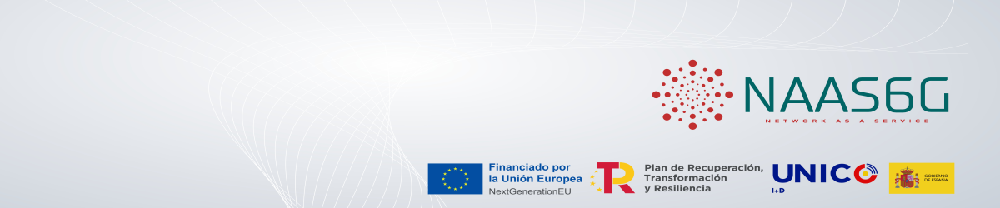

[](https://travis-ci.org/joemccann/dillinger)

### NaaS6G
---
##### Network As A Service

#### 1.0 Overview
---

(ES)
Proyecto NaaS-6G (Network. As a Service para redes 6G), con expediente TSI-064200-2022-10 financiado por el Ministerio de Asuntos Económicos y Transformación Digital y la Unión Europea – NextGenerationEU, dentro del Programa de Universalización de Infraestructuras Digitales para la Cohesión (Infraestructuras de investigación, equipamiento científico técnico y Proyectos de I+D en 5G Avanzado) UNICO I+D 5G-6G 2022 del Plan de Recuperación, Transformación y Resiliencia (PRTR).
(EN)
NaaS-6G project (Network As a Service for 6G networks), with ID number TSI-064200-2022-10 funded by the **Ministerio de Asuntos Economicos y Transformación Digital** y la **Union Euroipea – NextGenerationEU**, within the Universalization of Digital Infrastructures Program for Cohesion (Research infrastructure, technical scientific equipment and Advanced 5G R&D Projects) UNICO R&D 5G-6G 2022 of the Recovery, Transformation and Resilience Plan (PRTR)

NaaS-6G (Network as a Service para redes 6G) es un proyecto de innovación de Telefónica que tiene como objetivo definir, implementar y validar los modelos necesarios para dar soporte al despliegue y operación de las redes de telecomunicaciones del futuro (5G+ y 6G), que serán operadas en gran medida por sistemas basados inteligencia artificial.  La llegada de estas nuevas redes y los servicios de futuro que hacen uso de ellas, hacen que sea necesario que los modelos de gestión evolucionen e implementen nuevos procesos y herramientas enfocadas en asegurar la accesibilidad, eficiencia y flexibilidad para dar soporte a los requisitos y necesidades de los usuarios y garantizar la sostenibilidad de estas nuevas redes.  

 

Esta evolución debe enfocarse en generar modelos de consumo de recursos de red en modo servicio, lo que viene a ser llamado un modelo Network as a Service (NaaS).

> La llegada de estas nuevas redes y los servicios de futuro que hacen uso de ellas, hacen que sea necesario que los modelos de gestión evolucionen e implementen nuevos procesos y herramientas enfocadas en asegurar la accesibilidad, eficiencia y flexibilidad para dar soporte a los requisitos y necesidades de los usuarios y garantizar la sostenibilidad de estas nuevas redes.
> 


Main information included: 

- Overview
- Architecture
- Features
- Technical prerequisites
- Installation
- License

#### 2.0 naas6g-open5gs-cn
---
The architecture of this service component is  designed, blending modularity with efficiency. This component provides a OpenSource Core Network. Find below the developed services:


#### 3.0 Architecture
---
The architecture of this service component is  designed, blending modularity with efficiency. Find below modular architecture components of the component:


#### 4.0 Prerequisites
---


- GitHub as respository code in Git Organization repositories: (https://github.com/naas6g)
- Linkedin NAAS6G Project URL: (https://www.linkedin.com/company/naas6g/)


#### 5.0 Installation
---
Provided make commands to install and execute all dependencies and steps.

1. Disponir de repositorio con Open5Gs y fichero de aplciacion de ArgoCD.

2. Instalar ArgoCD

    Paso 1: Crear un namespace para ArgoCD
    ```
    kubectl create namespace argocd
    ```

    Paso 2: Instalar ArgoCD usando el manifiesto YAML oficial
    ```
    kubectl apply -n argocd -f https://raw.githubusercontent.com/argoproj/argo-cd/stable/manifests/install.yaml
    ```

3. Exponer el Servicio ArgoCD Server

```
kubectl port-forward svc/argocd-server -n argocd 8080:443
```

4. Obtener las Credenciales Iniciales
```
kubectl -n argocd get secret argocd-initial-admin-secret -o jsonpath="{.data.password}" | base64 -d
```

5. Acceso a ArgoCD UI con las Credenciales Iniciales

6. Revisar o conectar el rpositorio en ArgoCD en formato https via token

7. Revisar o conectar el cluster a ArgoCD con credenciales iniciales siendo recomendable generar unas nuevas
```
argocd login localhost:8080
```

```
argocd cluster add default --name Cluster82 
```

8. Revisar o conectar el cluster a ArgoCD

9. Revisar definicion de url-host en el fichero etc/hosts en VM de salto y VM del cluster.

10. Añadir extra_host en docker ETL HUB compose para acceso a URL prometheus, skooner, grafaana.

11. Actualizar URL de acceo en variables de entorno de Airflow.

- En realación al CORE Open-Source:

12. Levantar RAN UERANSIM mediante Helm segun configuracion RAN:

- RAN Config: 
```
helm upgrade open5gs open5gs/ --values open5gs/values/custom-values/5gconfig-upd-2upf-2dnn.yaml
```

```
helm install ueransim-gnb-dnn1 openverso/ueransim-gnb --version 0.2.2 --values values/ran/custom-values-gnb-ues-d1-10UE-01.yaml
```

Revisar o conectar el cluster a ArgoCD

```
kubectl -n auto-open5gs exec -ti deployment/ueransim-gnb-dnn1-ues -- /bin/bash
```
```
ping -I uesimtun0 gradiant.org
```

#### License
---
MIT

**Telefonica Innovacion Digital**
